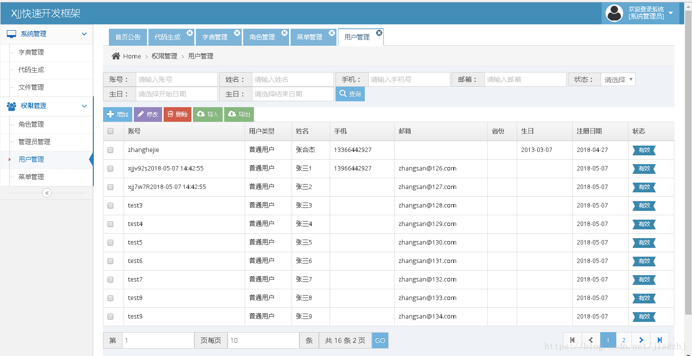
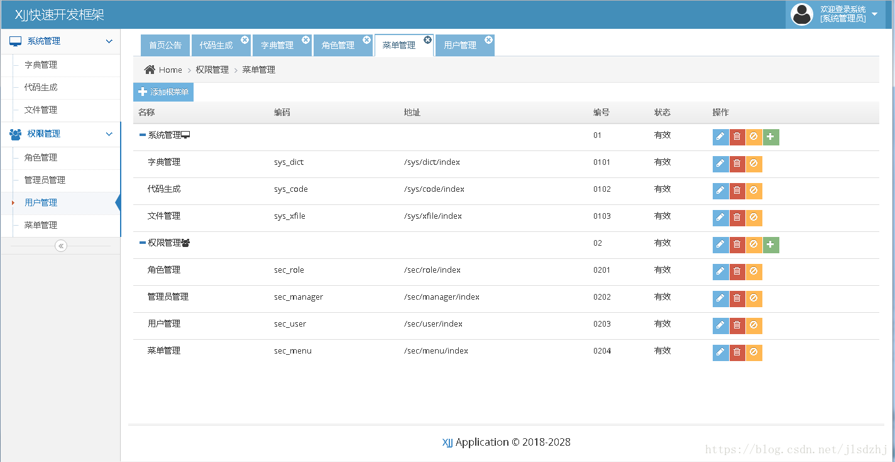
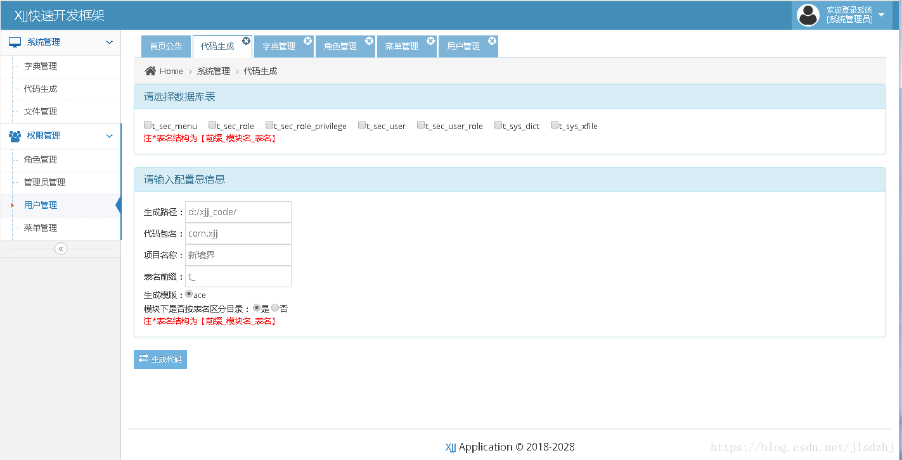
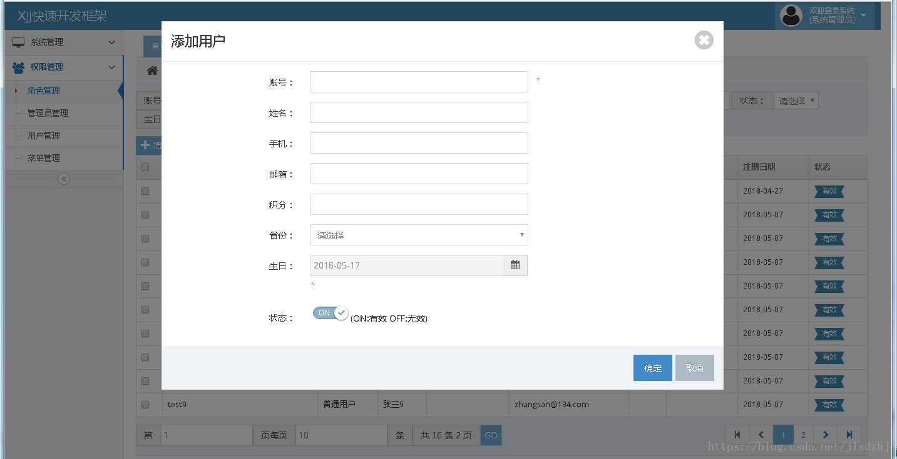
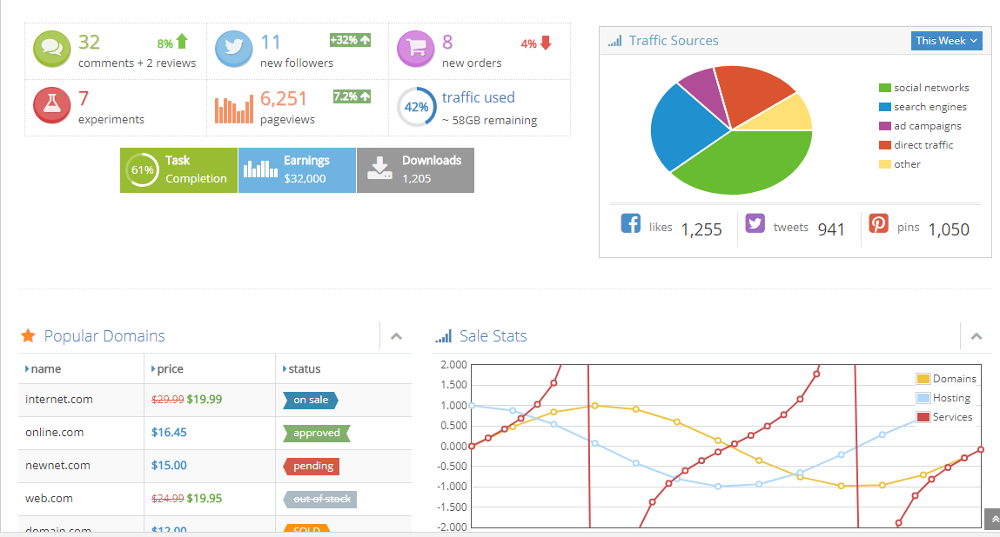

# jeexjj
- 小而美的单体应用，j2ee极速轻量快速开发框架。QQ交流群：174266358。
- 基于spring cloud的微服务架构的企业开发框架，请移步
[https://gitee.com/zhanghejie/jeeCloud](https://gitee.com/zhanghejie/jeeCloud)。

#### 项目介绍
jeexjj是一款基于SSM的一款快速开发框架，能够根据数据库生成单表和一对多表的增删改查代码，使开发节省50%的开发工作量。
使用XJJ可以快速地开发出企业级的Web应用系统。 生成的代码统一规范、统一风格、统一结构便于管理维护。
前端页面使用当前最流行的ACE和bootstrap技术，自适应pc、移动端。

#### 技术选型
#### 后端技术:
技术 | 名称 | 官网
----|------|----
spring-boot | 后端框架  | [http://spring.io/projects/spring-boot](http://spring.io/projects/spring-boot)
Spring Framework | 容器  | [http://projects.spring.io/spring-framework/](http://projects.spring.io/spring-framework/)
SpringMVC | MVC框架  | [http://docs.spring.io/spring/docs/current/spring-framework-reference/htmlsingle/#mvc](http://docs.spring.io/spring/docs/current/spring-framework-reference/htmlsingle/#mvc)
MyBatis | ORM框架  | [http://www.mybatis.org/mybatis-3/zh/index.html](http://www.mybatis.org/mybatis-3/zh/index.html)
Maven | 项目构建管理  | [http://maven.apache.org/](http://maven.apache.org/)
freemarker | 页面模板引擎  | [http://freemarker.foofun.cn/](http://freemarker.foofun.cn/)

#### 前端技术:
技术 | 名称 | 官网
----|------|----
jQuery | 函式库  | [http://jquery.com/](http://jquery.com/)
Bootstrap | 前端框架  | [http://getbootstrap.com/](http://getbootstrap.com/)
Font-awesome | 字体图标  | [http://fontawesome.io/](http://fontawesome.io/)
zTree | 树插件  | [http://www.treejs.cn/v3/](http://www.treejs.cn/v3/)
layui | 前端框架  | [http://layer.layui.com/](http://layer.layui.com/)
ace | 前端框架  | [http://ace.jeka.by/](http://ace.jeka.by/)

#### 项目页面效果

#### 安装教程

1. 安装jdk1.6+、tomcat6+、mysql5.5+
2. 下载代码并初始化数据库db/xjj_db_init.sql
3. 发布运行项目

#### 技术交流
1. QQ群：174266358
